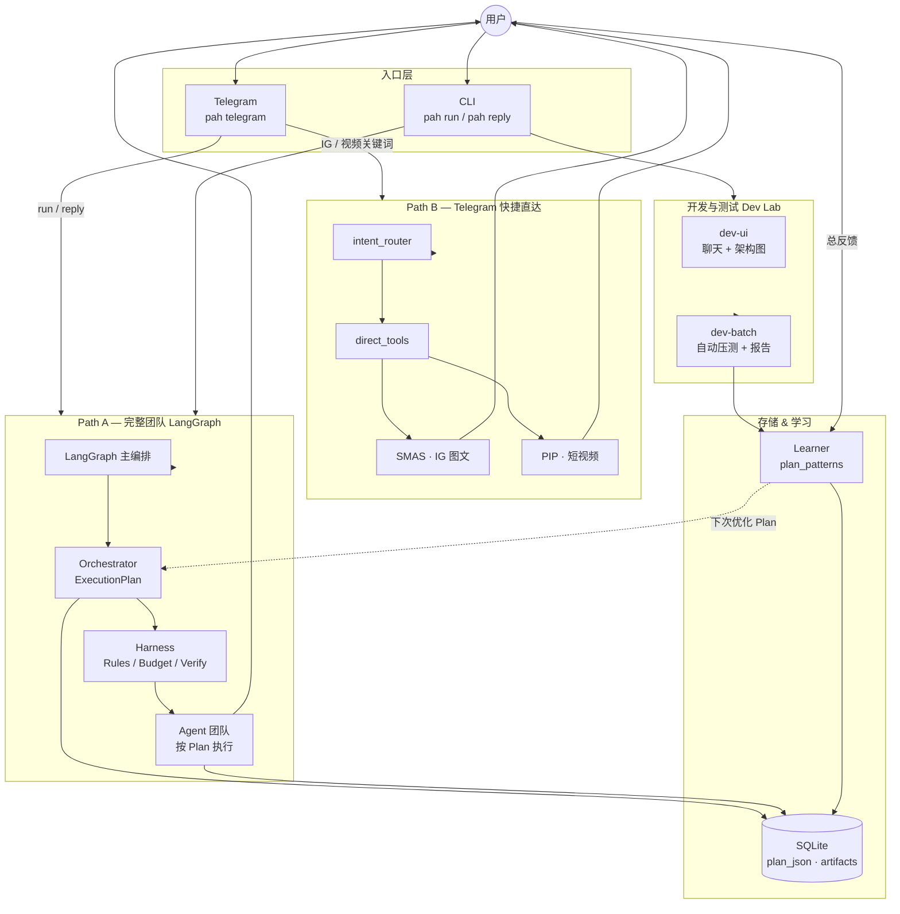
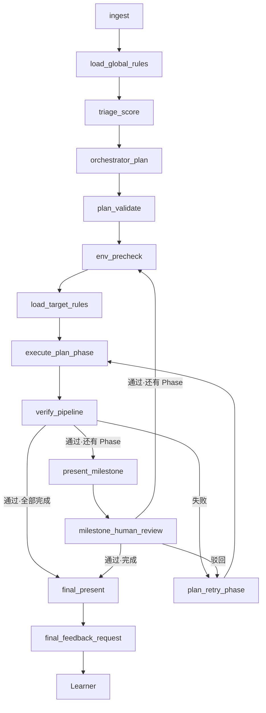

# PAHS

**Personal Agent Harness System**

A private, personal multi-agent assistant built with **LangGraph**, an **Orchestrator-driven execution plan**, a **Harness governance layer**, and **human-in-the-loop** review.

**个人专属多智能体助理系统** — 基于 **LangGraph** 编排、**Orchestrator 任务表**、**Harness 四层治理**，关键阶段引入**人工审核**与**反馈学习**。

[](https://github.com/ZacahryZhou/PAHS)
[](docs/ROADMAP.md)
[](docs/ARCHITECTURE.md)

---

## Table of Contents | 目录

- [Overview | 项目概述](#overview--项目概述)
- [Architecture | 系统架构](#architecture--系统架构)
- [Two Entry Paths | 两条入口路径](#two-entry-paths--两条入口路径)
- [Orchestrator & ExecutionPlan | 编排与任务表](#orchestrator--executionplan--编排与任务表)
- [Routing & Scoring | 三套判断机制](#routing--scoring--三套判断机制)
- [Agents & External Tools | Agent 与外部工具](#agents--external-tools--agent-与外部工具)
- [Harness Layers | Harness 四层](#harness-layers--harness-四层)
- [LangGraph Flow | 完整节点流](#langgraph-flow--完整节点流)
- [Cross-Channel Review | 跨通道审核](#cross-channel-review--跨通道审核)
- [Feedback & Learning | 反馈与学习](#feedback--learning--反馈与学习)
- [Dev Lab & Batch Testing | 开发与批量测试](#dev-lab--batch-testing--开发与批量测试)
- [Tech Stack | 技术栈](#tech-stack--技术栈)
- [Project Structure | 项目结构](#project-structure--项目结构)
- [Configuration | 配置说明](#configuration--配置说明)
- [Getting Started | 快速开始](#getting-started--快速开始)
- [CLI Reference | 常用命令](#cli-reference--常用命令)
- [Documentation | 文档索引](#documentation--文档索引)
- [Design Principles | 设计原则](#design-principles--设计原则)

---

## Overview | 项目概述

**EN**

PAHS is a **personal AI operating system** — not a generic chatbot. You send a command from **CLI** or **Telegram**. The system:

1. Creates a tracked **Run** with a unique `run_id`
2. **Triages** task difficulty (context for planning)
3. **Orchestrator** reads the project capability catalog and writes an internal **ExecutionPlan** (phases + tasks) — stored in `plan_json`, not shown to the user by default
4. **Harness** validates the plan, loads rules, checks budget, and executes each **Phase** (tasks can run **in parallel** within a phase)
5. Specialized **Agents** (Searcher, Creator, Executor) and **external tools** (SMAS, PIP) execute tasks; outputs flow through **artifacts** to downstream tasks
6. Pauses for **milestone review** between phases when configured
7. Collects **final feedback**; **Learner** proposes improvements to rules, standards, and **plan patterns** — never auto-applied

**中文**

PAHS 是一个**个人 AI 操作系统**。你通过 **CLI** 或 **Telegram** 下指令后：

1. 创建带 **`run_id`** 的 **Run**
2. **Triage** 粗分类（为编排提供上下文）
3. **Orchestrator** 读取能力清单，生成内部 **ExecutionPlan**（阶段 + 任务表），存入 `plan_json`，**默认不展示给用户**
4. **Harness** 校验计划、加载规则、预算预检，按 **Phase** 执行（阶段内 Task 可**并行**）
5. **Agent 团队**与**外部工具**（SMAS / PIP）按任务表执行；产出经 **artifacts** 传给下游
6. 按策略在阶段间 **暂停人工审核**
7. 收集 **总反馈**；**Learner** 优化 rules / standards / **plan_patterns** — **永不自动生效**

> **Current status | 当前状态**
>
> - **Path A (LangGraph):** Orchestrator + ExecutionPlan + phase execution + milestone review — **implemented**
> - **Harness:** Rules, budget, validation, **capability brief** (honest limits for account/publish/payment tasks) — **implemented**
> - **Search Router:** Smart Tavily / Perplexity (five-dimension scoring) — **live**
> - **External bridges:** SMAS (IG), PIP (video) via `config/external_agents.yaml` — **implemented**
> - **Dev Lab:** `pah dev-ui` — chat UI + live architecture graph — **implemented**
> - **Batch testing:** `pah dev-batch` + Learner holistic analysis (`batch_learner`) — **implemented** (100-run mock smoke: flow stable)
> - **Path B:** Telegram direct to SMAS/PIP — **implemented** (not yet unified through Orchestrator)
> - **Planned last:** Triage + Step Router **scoring** refinements; unify Telegram with Orchestrator

---

## Architecture | 系统架构

### System panorama | 系统全景



### Layer model | 分层模型

| Layer | 职责 | 关键模块 |
|-------|------|----------|
| **入口 Gateway** | 统一消息、run_id、跨通道 resume | `gateway/service.py`, `telegram_adapter.py` |
| **编排 Orchestrator** | 发任务表：几步、谁干、用什么工具 | `planning/orchestrator_planner.py` |
| **校验 Step Router** | 计划结构合法（工具/agent/依赖） | `planning/step_router.py` |
| **治理 Harness** | 规则、预算、验证、环境 | `harness/` |
| **执行 Agents** | Searcher / Creator / Executor / External | `agents/`, `external/` |
| **子路由 Search Router** | Search 步：Tavily vs Perplexity | `agents/search_router.py` |
| **学习 Learner** | 反馈 → rules / plan_patterns；批量测试后整体分析 | `learning/learner.py`, `learning/batch_learner.py` |
| **Dev Lab** | 本地 UI + 自动批量测试 + 改进方案 | `devlab/` |

---

## Two Entry Paths | 两条入口路径

| | **Path A — 完整流程** | **Path B — Telegram 直达** |
|---|------------------------|------------------------------|
| **触发** | `pah run "..."` / Telegram `run ...` / `reply` | Telegram 自然语言（IG、视频等关键词） |
| **经过 Orchestrator?** | ✅ 是 | ❌ 否（`intent_router` → `direct_tools`） |
| **适用** | 调研、多步、代码、复杂任务 | 快速出 IG 图文 / 短视频 |
| **人工审核** | LangGraph milestone interrupt | SMAS：`好` / `改：…` |

Path B 未来计划并入 Orchestrator；当前两条路径并存。

---

## Orchestrator & ExecutionPlan | 编排与任务表

Orchestrator 是**发令者**：读用户命令 + 能力清单 + 历史 `plan_patterns`，写出内部任务表。

```text
ExecutionPlan
├── intent_summary          # 任务摘要（内部）
├── complexity_band         # simple | medium | complex
├── review_policy           # per_phase | final_only
└── phases[]
    ├── phase_1  parallel=true   # 阶段内可共行
    │   ├── task t1  searcher
    │   └── task t2  searcher
    ├── phase_2  depends_on: [phase_1]
    │   └── task t3  creator  inputs_from: [t1, t2]
    └── phase_3
        └── task t4  external/smas  inputs_from: [t3]
```

- **Plan 存哪：** `runs.plan_json` + graph state `execution_plan` / `plan_artifacts`
- **往下传：** 每个 task 的 output 写入 `plan_artifacts[task_id]`，下游通过 `inputs_from` 读取
- **预览（不执行）：** `pah plan-preview "你的命令"`

**能力清单来源：** `config/external_agents.yaml`（SMAS、PIP）+ `harness/tools.py`（search_web、run_python 等）

---

## Routing & Scoring | 三套判断机制

三套机制**分工不同**，按流程**依次触发**（不是同时打分）：

| # | 机制 | 何时跑 | 决定什么 | 状态 |
|---|------|--------|----------|------|
| ① | **Triage** | 每次 `pah run` 开头 | 粗分类、complexity、Orchestrator 上下文 | 打分 **待最后统一改** |
| ② | **Step Router** | Orchestrator 出 plan 后 | plan 是否合法（工具/依赖） | 仅结构校验；打分 **待最后改** |
| ③ | **Search Router** | Searcher task 执行时 | Tavily vs Perplexity（五维：实时/准确/深度/权威/多源） | ✅ **已完成** |

```text
用户输入 → ① Triage → Orchestrator 写 Plan → ② Step Router 校验
         → 按 Plan 执行 → Searcher task 时 → ③ Search Router
```

---

## Agents & External Tools | Agent 与外部工具

### Internal workers | 内部 Agent

| Worker | 职责 | 工具 / 模式 |
|--------|------|-------------|
| **Searcher** | 调研、查最新、对比 | `search_web` → Search Router → Step 2 DeepSeek 润色 |
| **Creator** | 文案、报告、解释 | `generate_content` / DeepSeek |
| **Executor** | 代码、分析、深度推理 | `CODE` / `ANALYSIS` / `DEEP_THINK` |

### External tools | 外部工具（子项目）

| Tool | 项目 | 用途 | 配置 |
|------|------|------|------|
| **SMAS** | `~/Desktop/SMAS` | Instagram / 图文生成 + 预览图 | `config/external_agents.yaml` |
| **PIP** | `~/Desktop/PIP` | 短视频生成 | 同上 |

External 既可出现在 **ExecutionPlan** 的 task 里（Path A），也可被 Telegram **直达**（Path B）。

### Executor modes | 执行模式

| Mode | 何时 | 能力 |
|------|------|------|
| `DEEP_THINK` | 深度推理 | deepseek-reasoner |
| `CODE` | 代码、文件 | `run_python`, `read_file`, `write_file` |
| `ANALYSIS` | 数据、图表 | Python sandbox + 解读 |

---

## Harness Layers | Harness 四层

每一次 Phase 执行都经过 Harness：

| Layer | 中文 | 作用 |
|-------|------|------|
| **Rules** | 规则 | `rules/global/` + `rules/agents/{worker}.md`，按需加载 |
| **Tools** | 工具 | 仅允许 plan 中声明且已 APPROVED 的工具 |
| **Validation** | 验证 | `verify_pipeline` — 输出质量校验，失败可重试本 Phase |
| **Capability** | 能力边界 | `capability_brief.py` — 账号/发布/付款等缺口检测，注入 Triage / Orchestrator / Agents |
| **Environment** | 环境 | 预算、token、降级、无进展检测 |

```text
每次 Run：global rules → triage → orchestrator plan → plan validate
每个 Phase：env precheck → target rules → execute_plan_phase → verify
```

---

## LangGraph Flow | 完整节点流

`pah run` 走以下 LangGraph 节点（`src/pahs/graph/main.py`）：



---

## Cross-Channel Review | 跨通道审核

所有通道共享 SQLite 中的同一份 `run_id` 状态。

```bash
pah run "调研 LangGraph 并写一份中文笔记"
pah pending
pah reply run_20260624_155900_a3f9 "approved"
pah feedback run_20260624_155900_a3f9 "下次调研要加官方文档链接"
```

**Telegram 直达 SMAS：** 生成后回复 `好` 或 `改：你的意见`

---

## Feedback & Learning | 反馈与学习

| 类型 | 时机 | 触发 Learner? |
|------|------|---------------|
| **阶段审核** | Phase 之间 | 否 — 指导当前 Run |
| **总反馈** | 整单完成后 | 是 — 生成待批准提案 |

Learner 区分两类问题：

- **执行问题** → 更新 `rules/agents/*.md`、`standards/`
- **计划问题** → 更新 `standards/learned/plan_patterns/*.json`（下次 Orchestrator 参考）

```bash
pah proposals pending
pah proposals approve <proposal_id>
```

> 所有学习结果必须经你明确批准才会生效。  
> **批量测试**会为每轮生成 synthetic 反馈；跑完后 `batch_learner` 汇总全部数据生成 **改进方案**（`data/dev_batch_improvement_plan_*.md`）。提案与测试数据可用 `pah reset-test` 清理。

---

## Dev Lab & Batch Testing | 开发与批量测试

PAHS 提供两套互补的测试方式：

| 方式 | 命令 | 用途 |
|------|------|------|
| **Dev Lab UI** | `pah dev-ui` → http://127.0.0.1:8765 | 肉眼观察：聊天、架构节点高亮、审核、能力缺口提示 |
| **批量自动测试** | `pah dev-batch` | 机器反复跑场景语料，生成报告 + Learner 整体分析 |

### Batch workflow | 批量测试流程

```text
config/dev_batch_scenarios.yaml   # 15 种测试场景，轮换至 --runs 次数
        ↓
pah dev-batch --runs N [--mock]
        ↓
每轮：start_run → auto approve → synthetic feedback → Learner（可选）
        ↓
data/dev_batch_report_*.md        # 成绩单（缺陷统计）
data/dev_batch_improvement_plan_*.md  # 完整改进方案（规则层 + 代码层建议）
        ↓
你：复制 Plan 里「Copy-Paste Handoff」给 Cursor 改代码
    approve 有用的 Learner 提案：pah proposals approve <id>
```

### Mock vs real API | 测什么、用什么

| 模式 | 命令 | 测什么 | 建议次数 |
|------|------|--------|----------|
| **Mock** | `pah dev-batch --runs 100 --mock` | 流程、路由、预算、能力检测、不花钱 | 50～100 |
| **Real DeepSeek** | `pah dev-batch --runs 10 --no-mock` | 真实文案/计划质量，耗 API | 5～10 |

Mock 通过 **不代表** AI 回答质量合格；真实 API 小批量测试是下一步。

### Re-analyze without re-running | 只重新分析

```bash
pah dev-batch-analyze data/dev_batch_report_<timestamp>.json
```

### Clean test artifacts | 清理测试数据

```bash
pah reset-test   # 确认后删除 runs、events、proposals、checkpoints、batch 报告
```

`data/`、`rules/learnings/*.json` 已在 `.gitignore` 中，避免测试产物进入 git。

---

## Tech Stack | 技术栈

| Component | Choice | Notes |
|-----------|--------|-------|
| Orchestration | **LangGraph** | Plan-driven phase execution |
| Language | **Python 3.11+** | |
| Storage | **SQLite** | runs, plan_json, review_queue, proposals |
| LLM (primary) | **DeepSeek** | Orchestrator, Creator, Triage, Step 2 search |
| Search Step 1 | **Perplexity** + **Tavily** | Search Router (`SEARCH_PROVIDER=smart`) |
| External | **SMAS**, **PIP** | Local subprocess bridges |
| Entry | **CLI**, **Telegram** | WhatsApp stub |

---

## Project Structure | 项目结构

```text
PAHS/
├── config/
│   ├── external_agents.yaml    # SMAS, PIP, OpenClaw
│   ├── dev_batch_scenarios.yaml  # 批量测试语料
│   ├── budget.yaml
│   ├── models.yaml
│   └── gateway.yaml            # Telegram direct tools
├── rules/
│   ├── agents/                 # Creator, Searcher, Orchestrator 规则
│   ├── modes/                  # CODE, ANALYSIS, DEEP_THINK
│   └── learnings/              # Learner 提案（pending/approved/rejected）
├── standards/
│   └── learned/plan_patterns/  # Learner → Orchestrator 计划模式
├── data/                       # gitignored — runs.db, batch 报告
├── src/pahs/
│   ├── cli.py
│   ├── graph/                  # LangGraph 主编排
│   ├── devlab/                 # Dev Lab UI + batch_runner + batch_report
│   ├── gateway/                # Telegram, direct_tools, intent_router
│   ├── planning/               # ExecutionPlan, Orchestrator, Plan Executor
│   ├── agents/
│   │   ├── search_router.py    # Tavily / Perplexity 五维路由 ✅
│   │   ├── searcher.py
│   │   ├── plan_nodes.py
│   │   └── week1.py            # triage, orchestrator_plan, creator
│   ├── external/               # SMAS, PIP bridges
│   ├── harness/
│   │   └── capability_brief.py # 能力边界检测
│   ├── routing/
│   ├── learning/
│   │   ├── learner.py          # 单次总反馈 → 提案
│   │   └── batch_learner.py    # 批量测试后整体分析
│   └── tools/search_web.py
└── docs/
    ├── ARCHITECTURE.md
    ├── ROADMAP.md
    ├── DEVLAB_ROADMAP.md
    └── PAHS_深度学习教程_详细版.md
```

---

## Configuration | 配置说明

```bash
cp .env.example .env
```

| Variable | Purpose |
|----------|---------|
| `DEEPSEEK_API_KEY` | Orchestrator, Creator, Triage, Search Step 2 |
| `SEARCH_PROVIDER` | `smart` \| `auto` \| `perplexity` \| `tavily` \| `mock` |
| `PERPLEXITY_API_KEY` | Deep research search (Step 1) |
| `TAVILY_API_KEY` | Light lookup search (Step 1) |
| `SEARCH_ROUTE_USE_LLM` | Gray-zone plan routing via DeepSeek (optional) |
| `TELEGRAM_BOT_TOKEN` | Telegram bot |

**Never commit `.env`.**

---

## Getting Started | 快速开始

### Prerequisites

- Python 3.11+
- API keys — see `.env.example`

### Setup

```bash
git clone https://github.com/ZacahryZhou/PAHS.git
cd PAHS
python3 -m venv .venv && source .venv/bin/activate
pip install -e .
cp .env.example .env
# Edit .env with your keys

pah init-db
```

> **CLI 入口：** 激活 venv 后用 `pah ...`，或 `python3 -m pahs.cli ...`（注意 `-m`，不是 `python3 pahs.cli`）。

### Run

```bash
# Full team flow (Path A)
pah run "Research LangGraph and summarize in Chinese"

# Telegram bot
pah telegram

# Dev Lab — chat UI + live architecture progress
pah dev-ui
# open http://127.0.0.1:8765

# Batch smoke test (mock, fast — validates flow)
pah dev-batch --runs 10 --mock

# Preview internal plan without executing
pah plan-preview "调研 Perplexity 和 Tavily，然后做一条 IG 图文"
```

### Typical workflow | 推荐工作流

```text
1. pah dev-batch --runs 100 --mock     # 流程体检
2. pah dev-batch --runs 10 --no-mock   # 真实 API 质量抽查（需 DEEPSEEK_API_KEY）
3. 打开 data/dev_batch_improvement_plan_*.md → 复制 Handoff 给 Cursor 改代码
4. pah proposals pending → approve 有用的规则提案
5. pah reset-test                      # 测完清理，保持项目精简
```

---

## CLI Reference | 常用命令

| Command | 作用 |
|---------|------|
| `pah run "..."` | 启动完整 LangGraph Run（Path A） |
| `pah plan-preview "..."` | 预览内部 ExecutionPlan，不执行 |
| `pah route-preview "..."` | 预览 Triage 路由 |
| `pah search-route-preview "..."` | 预览 Search Router（Tavily/Perplexity） |
| `pah search-status` | 查看搜索配置 |
| `pah llm-status` | 查看 LLM 提供商状态 |
| `pah pending` | 待审核列表 |
| `pah reply <run_id> "approved"` | 回复阶段审核 |
| `pah feedback <run_id> "..."` | 提交总反馈 → Learner |
| `pah proposals pending` | 查看学习提案 |
| `pah proposals approve <id>` | 批准学习提案 |
| `pah dev-ui` | Dev Lab 测试页（聊天 + 架构进度） |
| `pah dev-batch --runs N --mock` | 批量自动测试 + 报告 + Learner 整体分析 |
| `pah dev-batch --runs N --no-mock` | 批量测试（真实 DeepSeek API） |
| `pah dev-batch-analyze <report.json>` | 对已有 batch JSON 重新生成改进方案 |
| `pah reset-test` | 清理所有测试 runs / proposals / 报告 |
| `pah telegram` | 启动 Telegram bot |

---

## Documentation | 文档索引

| Document | Content |
|----------|---------|
| [`README.md`](README.md) | 项目总览（本文件） |
| [`docs/ARCHITECTURE.md`](docs/ARCHITECTURE.md) | 架构规格 |
| [`docs/ROADMAP.md`](docs/ROADMAP.md) | 开发路线 |
| [`docs/DEVLAB_ROADMAP.md`](docs/DEVLAB_ROADMAP.md) | Dev Lab 路线图 |
| [`docs/EXTERNAL_AGENTS_SETUP.md`](docs/EXTERNAL_AGENTS_SETUP.md) | SMAS / PIP 接入说明 |
| [`docs/PAHS_深度学习教程_详细版.md`](docs/PAHS_深度学习教程_详细版.md) | 代码走读教程 |
| [`docs/PAHS_架构流程图.md`](docs/PAHS_架构流程图.md) | 架构流程图 |

---

## Design Principles | 设计原则

| # | English | 中文 |
|---|---------|------|
| 1 | **Orchestrator publishes the plan** — agents follow the task table | **Orchestrator 发任务表** — Agent 按表执行 |
| 2 | **Plan is internal** — stored, learned from; not shown by default | **计划内部存储** — 可学习，默认不展示 |
| 3 | **Phases can parallelize** — artifacts pass downstream | **阶段内可并行** — artifacts 下传 |
| 4 | **Harness wraps every phase** | **每个 Phase 都过 Harness** |
| 5 | **Three routing layers** — Triage → Step Router → Search Router | **三层路由分工** — 各管一层 |
| 6 | **Learn plan + execution** — Learner updates rules and plan_patterns | **计划与执行都学习** |
| 7 | **You define "done"** — milestone review + final feedback | **你定义「完成」** |
| 8 | **Nothing auto-applies** — proposals need approval | **学习永不自动生效** |
| 9 | **One state, all channels** — `run_id` + SQLite | **一份状态，所有通道** |
| 10 | **Honest capability surface** — flag what PAHS cannot do (accounts, publish, payments) | **诚实能力边界** |
| 11 | **Batch test the harness** — mock for flow, real API for quality | **批量测流程，小批测质量** |
| 12 | **Builder never auto-deploys** | **Builder 永不自动上线** |

---

## License & Status

Private personal project. **Active development.**

**Done:** LangGraph plan execution, Search Router, capability brief, SMAS/PIP bridges, Dev Lab UI, batch testing + batch Learner analysis, Telegram Path B.

**Next:** Unify Telegram with Orchestrator (Path B → Path A); real-API quality pass; final scoring for Triage + Step Router.

**Ecosystem:** PAHS is the **orchestrator**; **SMAS** (`~/Desktop/SMAS`) handles IG content; **PIP** (`~/Desktop/PIP`) handles short video — registered in `config/external_agents.yaml` as external tools, not separate chatbots.

---

<p align="center">
  <b>PAHS</b> — Personal Agent Harness System<br>
  个人专属多智能体助理系统<br>
  <a href="docs/ARCHITECTURE.md">Architecture</a> ·
  <a href="docs/ROADMAP.md">Roadmap</a> ·
  <a href="https://github.com/ZacahryZhou/PAHS">GitHub</a>
</p>
