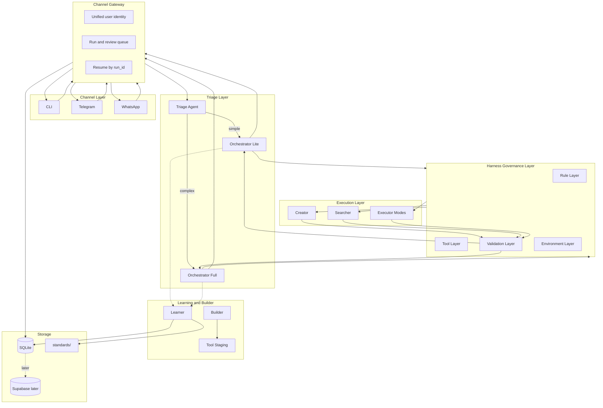

# PAHS Architecture

**PAHS** (Personal Agent Harness System) — baseline architecture for the personal multi-agent assistant.

Project path: `~/Desktop/PAHS`

## 1. Core Idea

PAHS is a private multi-agent assistant built around four ideas:

1. A LangGraph execution graph controls the workflow.
2. A harness layer governs every run with rules, tools, validation, and environment checks.
3. The user reviews important milestones, and the system learns only after the whole run is finished.
4. Builder can create tools, but generated tools stay in staging until manual approval.

The system should feel like a personal project manager:

- You send a command from CLI, Telegram, or WhatsApp.
- The system creates a run with a `run_id`.
- A triage step scores difficulty.
- A Lite or Full Orchestrator plans the work.
- Worker agents or execution modes produce milestone outputs.
- Internal validation catches obvious problems.
- You review milestones.
- At the end, you give final feedback.
- Learner turns that final feedback into pending improvements.

## 2. Important Terms

### Run

A Run is one full user request from start to finish.

Example:

> "Research LangGraph checkpointing and write Chinese notes."

That entire request is one Run.

### run_id

`run_id` is the unique ID for one Run.

It is like an order number, ticket number, or tracking number.

Example:

```text
run_20260624_155900_a3f9
```

The system uses `run_id` to know:

- which task is currently running
- which milestone is waiting for review
- which channel started the task
- where to resume the LangGraph checkpoint
- which feedback belongs to which task
- which costs, tools, logs, and artifacts belong together

This is especially important for cross-channel review. A task may start in Telegram but be approved from CLI. The `run_id` connects those messages to the same task.

### Milestone

A Milestone is one reviewable stage inside a Run.

Example Run:

```text
Run: research and write notes
Milestone 1: research summary
Milestone 2: outline
Milestone 3: final note file
Milestone 4: final feedback
```

### Agent

An Agent is a stable role with its own rules, tools, and model choices.

Current v1 agents:

- Triage Agent
- Orchestrator Lite
- Orchestrator Full
- Creator
- Searcher
- Learner
- Builder

### Mode

A Mode is not a full separate agent. It is an execution profile used by the Executor.

Current v1 modes:

- `DEEP_THINK`: hard reasoning and planning
- `CODE`: code, shell, files
- `ANALYSIS`: data, CSV, charts, metrics

## 3. High-Level Architecture



## 4. Channel Gateway

The Channel Gateway solves cross-channel state.

The system should not keep separate task state inside Telegram, WhatsApp, or CLI. All state lives in SQLite. Every channel reads and writes the same run and review tables.

Responsibilities:

- Convert CLI, Telegram, and WhatsApp messages into one internal message format.
- Map all user identities to the same local user.
- Create new runs.
- Attach replies to existing runs by `run_id`.
- Resume paused LangGraph checkpoints.
- Prevent duplicate approval if two channels reply to the same pending review.

Internal message shape:

```python
class InboundMessage:
    channel: str              # cli | telegram | whatsapp
    user_id: str
    text: str
    run_id: str | None
    attachments: list
```

## 5. Cross-Channel Review

Cross-channel review uses a central `review_queue` table.

Example:

1. You start a Run from Telegram.
2. The system reaches Milestone 1 and pauses.
3. SQLite stores a pending review row.
4. You can reply from Telegram, CLI, or WhatsApp.
5. Gateway resolves the pending review by `run_id`.
6. LangGraph resumes from the saved checkpoint.

Minimum tables:

```sql
CREATE TABLE runs (
  run_id TEXT PRIMARY KEY,
  user_id TEXT NOT NULL,
  status TEXT NOT NULL,
  orchestrator_profile TEXT,
  origin_channel TEXT,
  current_milestone_id TEXT,
  command TEXT,
  plan_json TEXT,
  created_at TEXT,
  updated_at TEXT
);

CREATE TABLE review_queue (
  id INTEGER PRIMARY KEY,
  run_id TEXT NOT NULL,
  milestone_id TEXT,
  review_type TEXT NOT NULL,
  payload_json TEXT,
  status TEXT DEFAULT 'pending',
  presented_at TEXT,
  resolved_at TEXT,
  resolved_via_channel TEXT
);

CREATE TABLE user_channels (
  user_id TEXT,
  channel TEXT,
  channel_user_id TEXT,
  PRIMARY KEY (channel, channel_user_id)
);
```

## 6. Triage and Orchestrator Profiles

The system has a Triage Agent before Orchestrator.

This reduces Orchestrator overload.

Triage scores:

- task type
- complexity
- risk
- whether research is needed
- whether code is needed
- whether deep reasoning is needed
- estimated milestone count

Example output:

```json
{
  "complexity_score": 62,
  "complexity_band": "medium",
  "task_type": "research_report",
  "risk_level": "medium",
  "needs_research": true,
  "needs_code": true,
  "needs_deep_reasoning": false,
  "recommended_orchestrator": "full",
  "estimated_milestones": 3
}
```

Routing:

- Simple, low-risk tasks go to Orchestrator Lite.
- Complex, risky, multi-step, research, code, or data tasks go to Orchestrator Full.
- Full can call `DEEP_THINK` mode when deep reasoning is needed.

Lite profile:

- usually one milestone
- minimal planning
- no R1 unless escalated
- fast output

Full profile:

- multiple milestones
- explicit plan
- cost estimate
- richer monitoring
- may use `DEEP_THINK`, `CODE`, or `ANALYSIS`

## 7. Harness Layers

Every execution goes through four governance layers.

### Rule Layer

Rules are loaded lazily.

Global rules are loaded every run. Agent or mode rules are loaded only after Orchestrator selects that agent or mode.

Directory:

```text
rules/
├── AGENTS.md
├── global/
│   ├── safety.md
│   └── budget.md
├── agents/
│   ├── orchestrator.md
│   ├── creator.md
│   └── searcher.md
├── modes/
│   ├── deep_think.md
│   ├── code.md
│   └── analysis.md
└── learnings/
    ├── pending/
    └── approved/
```

### Tool Layer

Only approved tools can be called by Orchestrator.

Builder-created tools are placed in staging and are invisible to production routing until manually approved.

### Validation Layer

Validation has layers:

1. Stage 1: deterministic checks
2. Stage 1.5: heuristics
3. Stage 2: LLM verification only for gray-area or high-risk cases
4. User milestone review

### Environment Layer

Environment checks:

- token budget
- cost budget
- model downgrade chain
- API availability
- timeout
- no-progress detection

## 8. Feedback and Learning

The system separates milestone review from learning.

Milestone review:

- happens during the run
- tells the system how to proceed for this run
- does not automatically become permanent learning

Final feedback:

- happens after the whole run is done
- is used by Learner
- produces pending rule, standard, routing, or process proposals
- does not become active until manually approved

Learner writes suggestions to pending files or pending database rows.

Nothing learned becomes active automatically.

## 9. Builder Safety

Builder can create tools, but generated tools cannot be used directly.

Lifecycle:

```text
DRAFT
→ TESTING
→ PENDING_REVIEW
→ APPROVED or REJECTED
→ DEPRECATED if later disabled
```

Builder pipeline:

1. Analyze requirement.
2. Search docs if needed.
3. Generate code and tests.
4. Run tests and sandbox checks.
5. Put output in staging.
6. Ask user to review.
7. Only after approval, move to approved production registry.

Hard rules:

- staging tools are not callable by Orchestrator
- tests passing is not enough
- manual approval is required
- secrets must not be printed or stored in generated code

## 10. Storage Strategy

v1 uses SQLite and files.

Supabase is a later option for cloud sync, remote dashboard, or multi-device querying.

The architecture should keep storage behind an interface so SQLite can later be mirrored to Supabase.

## 11. Current Model Plan

No local LLM for now.

Default cloud routing:

- Triage: DeepSeek V3 or another cheap fast model
- Orchestrator Lite/Full: DeepSeek V3
- Deep reasoning: DeepSeek R1
- Creator: DeepSeek V3, GPT-4o, or Claude Sonnet depending on quality
- Searcher: DeepSeek V3 plus search API
- CODE mode: DeepSeek V3 or Kimi
- ANALYSIS mode: Python plus DeepSeek V3 explanation
- Verification Stage 2: DeepSeek V3 only when needed
- Builder: Claude Sonnet or DeepSeek V3

API keys live locally in `.env` and should never be committed.
