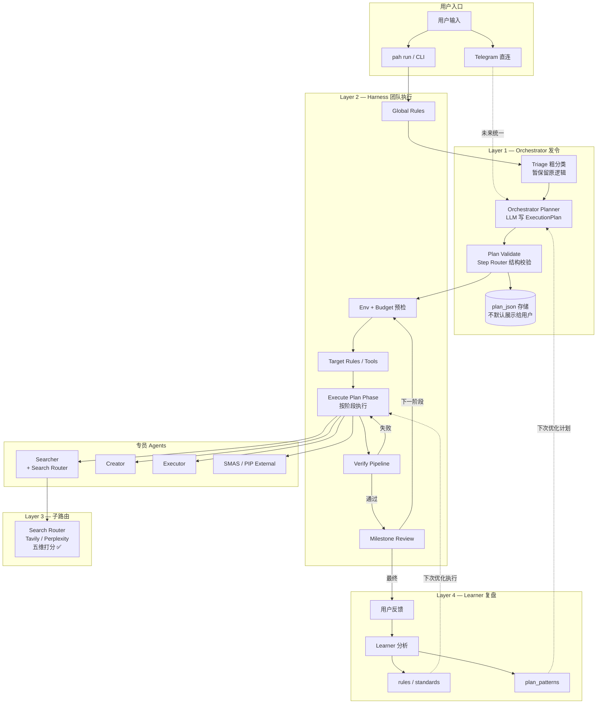
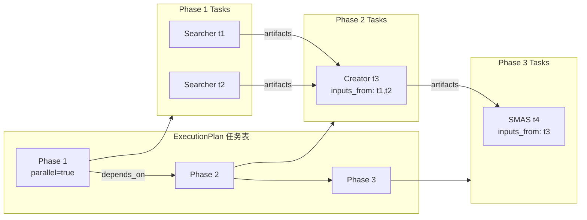
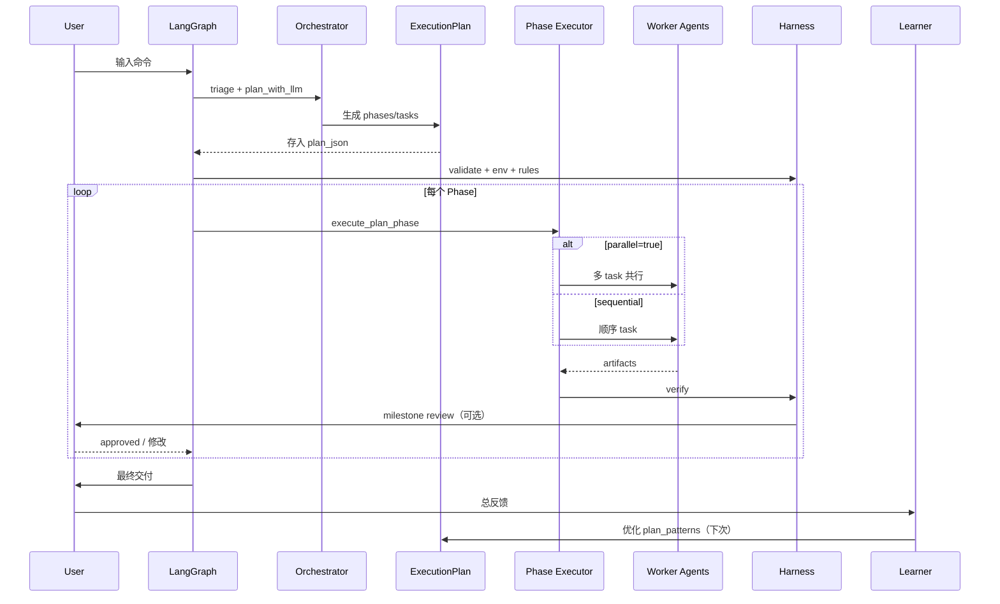

# PAHS 架构流程图

> Orchestrator 中枢 + 分步计划 + Harness 团队执行 + Learner 复盘  
> 打分机制（Triage Step Router / Search Router 调参）在整体架构就绪后最后统一修改。

---

## 总览



---

## ExecutionPlan 结构



---

## 单次 `pah run` 时序



---

## 两套机制触发时机（打分最后改）

| 机制 | 何时触发 | 当前状态 |
|------|----------|----------|
| **Triage** | 每次 run 开头，给 Orchestrator 上下文 | 原逻辑保留，打分待最后改 |
| **Step Router** | Orchestrator 出 plan 后，结构校验 | ✅ 仅校验，无打分 |
| **Search Router** | Searcher task 执行时 | ✅ 五维打分已完成 |

---

## 关键 CLI

```bash
pah plan-preview "你的命令"        # 看内部任务表（不执行）
pah route-preview "你的命令"         # 看 Triage 路由（打分待改）
pah search-route-preview "查询"    # 看 Search 子路由
pah run "你的命令"                 # 完整团队执行
```

---

## 代码地图

| 模块 | 路径 |
|------|------|
| ExecutionPlan schema | `src/pahs/planning/schema.py` |
| 能力清单 | `src/pahs/planning/capability_catalog.py` |
| Orchestrator Planner | `src/pahs/planning/orchestrator_planner.py` |
| Step Router 校验 | `src/pahs/planning/step_router.py` |
| Phase 执行器 | `src/pahs/planning/plan_executor.py` |
| Graph 节点 | `src/pahs/agents/plan_nodes.py` |
| LangGraph 编排 | `src/pahs/graph/main.py` |
| Search Router | `src/pahs/agents/search_router.py` |
| Learner 计划学习 | `src/pahs/learning/learner.py` |
| 计划模式库 | `standards/learned/plan_patterns/` |
